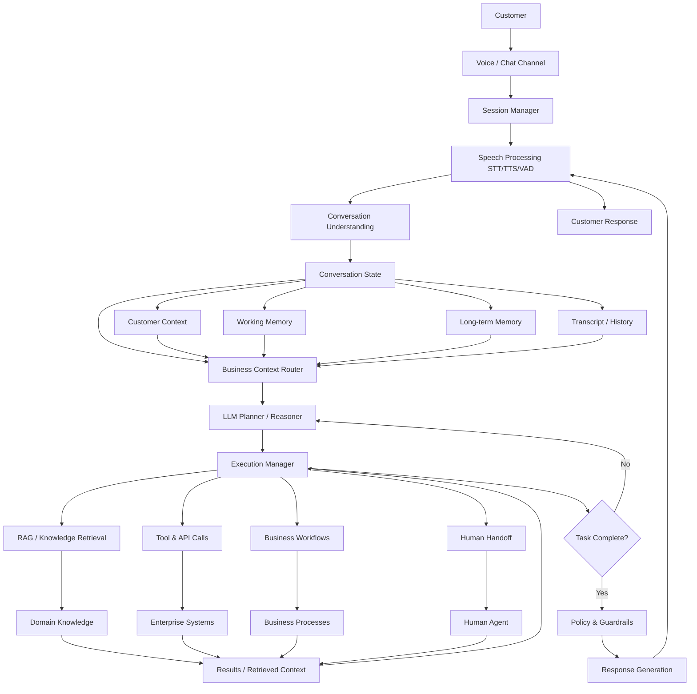

# BRAIN.md — Enterprise Voice-First AI Command Center
## Permanent Project Memory & Architecture Decisions

> **This document is the north star. Every architecture decision, every constraint, every rationale lives here. It is updated after every meaningful change.**

---

## 1. Project Identity

| Field | Value |
|---|---|
| **Project Name** | Enterprise Voice-First AI Command Center |
| **Version** | 0.1.0 (Initial Architecture) |
| **Demo Domain** | Insurance (plugin, not platform) |
| **Target Platform** | Azure Virtual Desktop (Windows native, no Docker) |
| **Repository Root** | `c:\Users\2862627\Desktop\command_center_2.0\` |

---

## 2. Architecture Decisions Log (ADL)

### ADL-001: Domain-Agnostic Platform Architecture
- **Decision**: All domain-specific behaviour (intents, entities, workflows, tools, policies, RAG knowledge) lives in YAML plugin files under `/backend/app/domains/<domain_name>/`. Zero domain knowledge in the orchestration engine core.
- **Rationale**: Single platform, multiple deployment verticals. Adding Insurance, Telecom, Banking requires no Python code changes — only a new domain YAML plugin.
- **Trade-offs**: Initial complexity in the plugin loader and tool registry; pays dividends at every subsequent domain addition.
- **Status**: Accepted, non-negotiable.

### ADL-002: No Docker
- **Decision**: Project runs on Azure Virtual Desktop (AVD) which does not support Docker. All services run as native Windows processes.
- **Rationale**: AVD constraint. Redis installed via `winget`, PostgreSQL via MSI if needed.
- **Trade-offs**: Slightly more complex setup documentation; production parity risk. Mitigated by pinned dependency versions and idempotent setup scripts.
- **Status**: Non-negotiable (hardware constraint).

### ADL-003: Detachable Frontend
- **Decision**: Frontend in `/frontend/`, backend in `/backend/`. Communication exclusively via WebSocket + REST HTTP. No shared code or imports.
- **Rationale**: Frontend is a temporary mock UI. A separate team will replace it. Backend must be frontend-agnostic.
- **Trade-offs**: Type duplication (Pydantic models → TypeScript types must be kept in sync manually or via codegen).
- **Status**: Accepted. OpenAPI 3.1 schema auto-generated by FastAPI serves as the contract.

### ADL-004: Open-Source Speech Stack (No Azure Speech)
- **Decision**: `faster-whisper` for STT, `kokoro-onnx` for TTS, `silero-vad` for VAD. `edge-tts` as zero-cost fallback.
- **Rationale**: Zero per-minute API billing. Runs entirely on-device. No Azure Speech API key required.
- **Trade-offs**: Higher RAM/CPU usage vs. API-based speech. Mitigated by `base` model for dev, `medium`/`large-v3` for production.
- **Status**: Accepted.

### ADL-005: LangGraph for Orchestration
- **Decision**: LangGraph `StateGraph` as the orchestration engine. Not raw LLM chains.
- **Rationale**: Explicit state machine with conditional edges, reasoning loops (max 3 iterations), and node-level observability. Better than ad-hoc chains for enterprise workflows.
- **Trade-offs**: LangGraph has a steeper learning curve. Compensated by explicit graph definition in `graph.py`.
- **Status**: Accepted.

### ADL-006: FAISS for Vector Store (Dev) / pgvector (Prod)
- **Decision**: FAISS in-memory index for development (zero friction). pgvector for production.
- **Rationale**: Eliminates PostgreSQL install dependency during development. Same interface; swappable via `VECTOR_STORE=faiss|pgvector` env var.
- **Trade-offs**: FAISS index is not persistent across restarts in dev. RAG must re-index on startup (acceptable for small knowledge bases).
- **Status**: Accepted.

### ADL-007: OpenAI-Compatible LLM Client
- **Decision**: LLM client uses the OpenAI Python SDK pointed at any compatible endpoint (Groq, Gemini OpenAI-compatible API, Azure OpenAI, local Ollama).
- **Rationale**: User confirmed open-source API keys (Groq/Gemini). The OpenAI SDK supports `base_url` override for any compatible endpoint.
- **Trade-offs**: Some providers don't support `response_format=json_schema`. Guardrail: client falls back to prompt-based JSON extraction if structured output fails.
- **Status**: Accepted. `LLM_BASE_URL` + `LLM_API_KEY` + `LLM_MODEL` in `.env`.

### ADL-008: Langfuse as Optional Observability
- **Decision**: Langfuse tracing is silently disabled if `LANGFUSE_SECRET_KEY` is not set in `.env`.
- **Rationale**: User confirmed Langfuse is optional. Avoids blocking development on observability setup.
- **Trade-offs**: Observability dark during development without a Langfuse account.
- **Status**: Accepted.

### ADL-009: Local Redis via winget
- **Decision**: Redis installed via `winget install Redis.Redis` during setup. `setup_env.ps1` handles installation and service start.
- **Rationale**: User selected local Redis for development simplicity.
- **Trade-offs**: Windows Redis port is community-maintained. Production must use Azure Cache for Redis.
- **Status**: Accepted for development. `REDIS_URL` env var points to Azure Cache for Redis in production.

### ADL-010: Sentence-Transformers for RAG Embeddings
- **Decision**: `sentence-transformers` (local, on-device) for RAG embedding. Model: `all-MiniLM-L6-v2` (fast, 80MB).
- **Rationale**: User selected zero-cost, no-API-key local embeddings.
- **Trade-offs**: Lower embedding quality than OpenAI `text-embedding-3-small`. Acceptable for demo.
- **Status**: Accepted. `EMBEDDING_MODEL` env var can override.

---

## 3. Non-Negotiable Rules

1. **No Docker, ever.** No `Dockerfile`, no `docker-compose.yml`. All scripts are PowerShell `.ps1`.
2. **Domain-agnostic core.** Zero hardcoded domain knowledge in orchestrator, tool registry, or memory system.
3. **Frontend isolation.** Backend must work identically with or without the frontend. `FRONTEND_ENABLED=false` must not break anything.
4. **Secrets never in source.** No hardcoded API keys, connection strings, or credentials anywhere in the codebase.
5. **Structured logging.** Every log line is JSON and includes `session_id` and `trace_id`.
6. **Deterministic mock tools.** Same input → same output always. Seeded by `hashlib.md5(input.encode()).hexdigest()[:8]`.
7. **No breaking API changes without major version bump.** `/api/v1/` endpoints are stable contracts.

---

## 4. Technology Stack

| Layer | Technology | Justification |
|---|---|---|
| **Backend Framework** | FastAPI (Python 3.11+) | Async-native, OpenAPI auto-gen, WebSocket support |
| **Orchestration** | LangGraph | Stateful multi-agent graph, explicit state machine |
| **LLM Client** | OpenAI Python SDK (any-compatible) | Groq/Gemini/Azure OpenAI via `base_url` |
| **STT** | faster-whisper (CTranslate2) | On-device, zero API cost, streaming-capable |
| **VAD** | Silero VAD (torch) | CPU-friendly, accurate speech boundary detection |
| **TTS Primary** | Kokoro ONNX | Zero API cost, local ONNX runtime, good quality |
| **TTS Fallback** | edge-tts | Free Microsoft Edge TTS, no account required |
| **Session State** | Redis (async) | Fast session CRUD, Pub/Sub for WS fan-out |
| **Vector Store** | FAISS (dev) / pgvector (prod) | Zero-friction dev, production-grade search |
| **Embeddings** | sentence-transformers | Local, no API key, `all-MiniLM-L6-v2` |
| **Observability** | Langfuse + OpenTelemetry | Optional, traces LLM calls + node latencies |
| **Frontend** | React 18 + TypeScript + Vite | Temporary mock; replaced by separate team |
| **State Mgmt** | Zustand | Lightweight, TypeScript-native |
| **Build** | Vite | Fast HMR, ESBuild |

---

## 5. Domain Abstraction Design

```
/backend/app/domains/
├── _base/
│   └── domain_schema.yaml   ← Schema every domain must satisfy
└── <domain_name>/
    ├── domain.yaml          ← Intent taxonomy, enabled tools, RAG config
    ├── workflows/           ← Per-workflow YAML files
    │   └── <workflow>.yaml
    ├── policies/
    │   └── rules.yaml       ← Domain-specific policy rules
    └── knowledge/           ← RAG source documents (markdown)
        ├── faq.md
        └── <docs>.md
```

**Plugin Discovery**: On startup, `lifespan.py` scans `domains/` directory, loads all `domain.yaml` files, registers tools, and builds FAISS indices per domain.

**Adding a new domain**:
1. Create `/backend/app/domains/<new_domain>/domain.yaml`
2. Add workflows, policies, knowledge under that directory
3. Add domain-specific tool implementations (no changes to core)
4. Restart the backend

---

## 6. Integration Points & Interface Boundaries

| Interface | Protocol | Contract Location |
|---|---|---|
| Browser ↔ Backend (Audio) | WebSocket binary (PCM 16kHz 16-bit mono) | `docs/api/API_CONTRACT.md` |
| Browser ↔ Backend (Control) | WebSocket JSON text frames | `docs/api/API_CONTRACT.md` |
| Browser ↔ Backend (REST) | HTTP/JSON, OpenAPI 3.1 | `/api/v1/docs` (auto-generated) |
| Backend ↔ Redis | `redis.asyncio`, key schema `session:{id}` | `services/session/manager.py` |
| Backend ↔ FAISS | Local FAISS index per domain | `orchestrator/nodes/rag.py` |
| Backend ↔ LLM | OpenAI-compatible REST API | `services/llm/client.py` |
| Backend ↔ Langfuse | Langfuse Python SDK (optional) | `observability/langfuse_client.py` |

---

## 7. Security & Compliance Rules

| Rule | Implementation |
|---|---|
| PII Masking | `guardrails.py` node: regex + LLM scrubbing of phone, account_no, ID in prompts |
| DPDP Act Compliance | Policy YAML rule: data lookup requires confirmed consent |
| High-Value Claim Gate | Domain policy rule: claim > ₹5,00,000 → `flags.awaiting_approval = True` |
| Unverified Transaction Block | Global policy: unverified customer cannot trigger payment/claim tools |
| Escalation Trigger | Frustrated sentiment AND turn_count > 5 → `should_escalate = True` |
| No Secrets in Code | All keys via `.env` file, validated at startup by Pydantic Settings |
| Structured Logging Only | No raw print() allowed; all logs via `structlog` with `session_id` + `trace_id` |

---

## 8. Known Limitations & Deferred Items

| Item | Status | Notes |
|---|---|---|
| pgvector (production LTM) | Deferred | FAISS used for dev. `VECTOR_STORE=pgvector` env var to switch. |
| Multi-language TTS (Indic) | Partial | Kokoro supports limited Indic voices; edge-tts fallback covers more. |
| Real CRM/Claims API integrations | Deferred | All tools are mock implementations. `# TODO` comments mark each. |
| WebRTC STUN/TURN for NAT traversal | Deferred | Direct WS audio assumed for demo (same network). |
| Horizontal Redis Pub/Sub scaling | Deferred | Single-node Redis assumed for demo. Redis Cluster for production. |
| Authentication / OAuth2 | Deferred | No auth on WebSocket. Assumed behind VPN/private network for demo. |
| Indic language intent taxonomy | Deferred | Insurance domain YAML covers English only. Language expansion via domain YAML. |

---

## Canonical Architecture Reference


